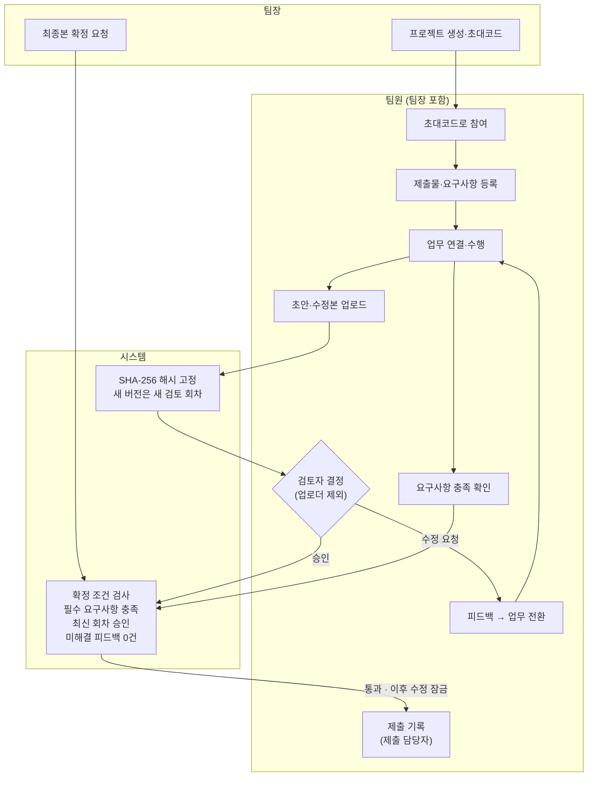
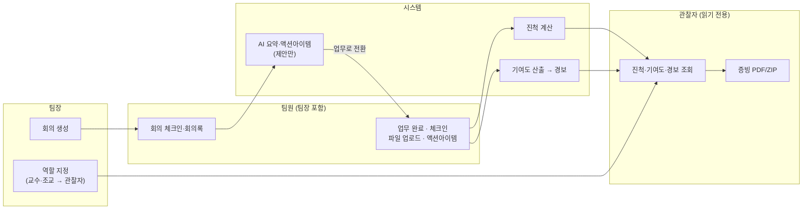
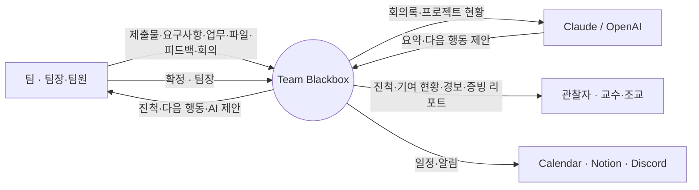

# Team Blackbox

> 대학생 팀 프로젝트에서 **"누가 뭘 얼마나 했는지"**를 외부 도구 로그 + 플랫폼 내부 활동 기반으로 자동 산출하고, 교수 전용 대시보드로 제공하는 EdTech SaaS.
>
> *Capstone Design 2026 — 팀 "손에 송잡고" (송병철 · 송승준 · 손정협 · 손정효)*

---

## 1. 프로젝트 소개

대학 팀 프로젝트에는 반복되는 구조적 문제가 있다 — **무임승차 판별 불가**, **기록의 분산·조작 가능성**, **교수자의 평가 사각지대**.

Team Blackbox의 설계 철학은 한 문장으로 요약된다:

> **"우리가 데이터를 만들지 않는다. 외부 시스템이 이미 기록한 데이터를 읽어올 뿐이다."**

이 프레임이 두 가지를 동시에 푼다 — 감시가 아닌 **읽기(Read-only)**라 개인정보를 방어하고, 학생이 시스템에서 조작할 수 있는 게 없어 **논리적으로 무결**하다.

### 데이터 무결성 2계층

| 계층 | 대상 | 보증 |
|---|---|---|
| **Level 1 — 플랫폼 내부 증빙** | 업로드 파일·태스크·회의 체크인 | **강한 보증** — SHA-256 해시 고정 + DB 트리거로 수정 원천 차단 |
| **Level 2 — 외부 시스템 로그** | GitHub 커밋, Google 활동 등 | **참조 수준** — 외부 API 데이터를 읽기 전용 수집 (GitHub·Google이 보증) |

---

## 2. 핵심 기능 (현행 구현 기준)

- **인증** — 이메일/비밀번호 회원가입·로그인, JWT(access + refresh), Google OAuth 콜백. Spring Security 무상태(stateless).
- **프로젝트** — 생성, 초대코드 발급/참여, 멤버·역할(LEADER/MEMBER/OBSERVER) 관리, 4단계 동의(consent) 구조.
- **칸반 태스크** — 생성/수정/삭제, 드래그앤드롭 상태 변경, 담당자 지정.
- **회의** — 생성, 체크인, 회의록, **AI 요약·액션아이템 추출**(Claude 우선, OpenAI 폴백) → 태스크 변환.
- **Hash Vault** — 파일 업로드 시 SHA-256 해시 고정, DB 트리거로 UPDATE/DELETE 차단(불변), 동일 파일 재업로드 시 변조 감지, 이력 조회.
- **기여도·경보** — 팀원별 활동을 집계해 기여 현황을 산출하고, 무임승차/이탈/과부하 경보를 제공.
- **무결성 리포트** — 증빙 PDF 다운로드, 증거 패키지 ZIP 다운로드(OpenPDF).
- **외부 연동(선택적, 키 없으면 자동 비활성)** — GitHub App, Google Calendar, Notion, Discord 알림, Claude / OpenAI AI.

---

## 3. 사용자 흐름

2학기 개발 계획([`DEVELOPMENT_PLAN.md`](docs/team/DEVELOPMENT_PLAN.md)) 기준 최종 결과물의 흐름이다. 역할별 칸에는 그 역할만 할 수 있는 일을 둔다. 제출물·업무·검토는 팀장도 팀원 칸의 일을 똑같이 한다.

### 제출물 흐름



- 요구사항 충족 확인은 검토와 별개로 언제든 할 수 있다. 충족 확인, 검토 승인, 팀장의 확정 요청은 서버의 확정 조건 검사로 모인다.
- 승인은 미해결 피드백이 0건일 때만 할 수 있고, 승인 뒤 추가 의견은 새 검토 회차에서 받는다.
- 제출 기록은 학교 시스템에 직접 제출한 뒤 남기는 기록이다. 자동 제출하지 않는다.

### 기록과 기여도



- 기여도는 팀원 활동 기록에서 나온다. 사용자가 따로 입력하지 않는다.
- AI는 요약과 액션아이템을 제안만 하고 자동 승인하지 않는다.

### 데이터 흐름 (DFD Level 0)



---

## 4. 기술 스택

| 영역 | 스택 |
|---|---|
| **백엔드** | Spring Boot 3.3.5 · Java 17 · Spring Web / Data JPA / Security / Validation · WebFlux(WebClient) · jjwt 0.12.6 · OpenPDF 1.3.30 |
| **프론트엔드** | Next.js 16 · React 18 · TypeScript 5 · Tailwind CSS 3 · Zustand 5 · axios · @dnd-kit(칸반) · Recharts · date-fns |
| **데이터베이스** | PostgreSQL 16 · Flyway 마이그레이션(V1~V18) |
| **인프라** | Docker Compose · Nginx 리버스 프록시(HTTP→HTTPS, SSL) |

---

## 5. 아키텍처

```
                    ┌───────────────────────────────┐
  브라우저 ──443──▶ │  Nginx (리버스 프록시 + SSL)   │
                    │   /api/  → backend:8080        │
                    │   /uploads/ → 정적 파일         │
                    │   /      → frontend:3000        │
                    └──────┬───────────────┬─────────┘
                           │               │
                  ┌────────▼─────┐  ┌──────▼────────────┐
                  │ Next.js (3000)│  │ Spring Boot (8080) │
                  └───────────────┘  └──────┬─────────────┘
                                            │ JDBC
                                     ┌──────▼────────┐
                                     │ PostgreSQL 16  │
                                     └────────────────┘
```

- 80포트는 443으로 리다이렉트. 모든 API는 `/api/` 프리픽스로 백엔드에 프록시.
- 인증은 JWT 무상태 — 프론트가 `Authorization: Bearer` 헤더로 호출.

---

## 6. 빠른 시작

**사전 요구:** Docker · Docker Compose.

```bash
# 1) 환경 변수 준비
cp .env.example .env
#   DB_PASSWORD · JWT_SECRET(32자 이상) 등을 채운다.
#   외부 연동(GitHub/Google/Notion/Discord/AI) 키는 비워두면 해당 기능만 비활성.

# 2) 전체 스택 기동 (db · backend · frontend · nginx)
docker compose up -d --build

# 3) 접속 (로컬은 self-signed 인증서)
#   https://localhost
```

- Windows 편의 스크립트: `start-local.ps1` / `start-local.bat` (`.env.local` 사용).
- DB만 띄우려면: `docker compose -f docker-compose.db-only.yml up -d`.
- 헬스 체크: `GET /api/health`.

---

## 7. 환경 변수

`.env.example`이 정본 목록이다. 핵심:

| 변수 | 용도 |
|---|---|
| `DB_NAME` / `DB_USER` / `DB_PASSWORD` | PostgreSQL |
| `JWT_SECRET` | JWT 서명 키 (최소 32자) |
| `JWT_EXPIRATION_MS` / `JWT_REFRESH_EXPIRATION_MS` | 토큰 만료 |
| `APP_CORS_ORIGINS` | CORS 허용 origin (로컬은 `*`) |
| `NEXT_PUBLIC_API_URL` | 프론트가 호출할 API base |

**선택 연동(비우면 비활성):** `GITHUB_APP_ID`·`GITHUB_APP_PRIVATE_KEY`·`GITHUB_WEBHOOK_SECRET`, `GOOGLE_CLIENT_ID`·`GOOGLE_CLIENT_SECRET`·`GOOGLE_REDIRECT_URI`, `CLAUDE_API_KEY`·`OPENAI_API_KEY`, `NOTION_API_KEY`·`NOTION_PARENT_PAGE_ID`·`NOTION_CALENDAR_DB_ID`, `DISCORD_WEBHOOK_URL`, `FRONTEND_BASE_URL`.

---

## 8. 프로젝트 구조

```
blackbox/
├── backend/      Spring Boot (controller · service · dto · entity · repository · security)
│   └── src/main/resources/db/migration/   Flyway V1~V18
├── frontend/     Next.js App Router (src/app · components · lib · types)
├── nginx/        리버스 프록시 + SSL 설정
├── docs/         아키텍처·운영 문서
├── md/           프로젝트 컨텍스트(claude.md) · 기획서 · 핸드오버 로그
└── docker-compose.yml
```

---

## 9. 문서

- **프로젝트 컨텍스트:** [`md/claude.md`](md/claude.md)
- **종합 기획서:** [`md/TeamBlackbox_기획서_v3.md`](md/TeamBlackbox_기획서_v3.md)
- **API 표:** [`md/handover_log.md`](md/handover_log.md)

---

*Team Blackbox — 2026 Capstone Design. 학습·발표 목적의 캡스톤 프로젝트.*
